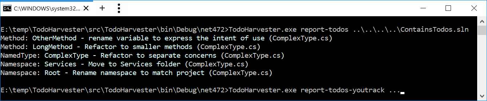
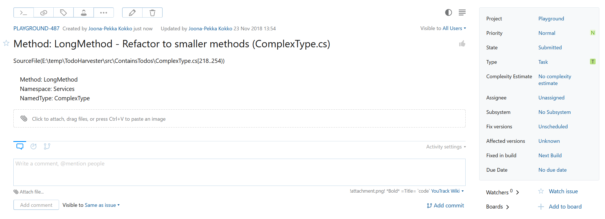

# TodoHarvester

Tool for collecting TODO comments from a codebase, using Roslyn. Supports pushing the comments to YouTrack.

Available functionality:
- Scan Visual Studio solution(s) for TODO comments
    - Optionally provide regexes to identify TODOs    
    - Search single & multi-line comments
- Push TODOs to
    - Stdout
    - YouTrack

Remarks: Quick project to support (myself) locating and recording possible sites that require intervention.